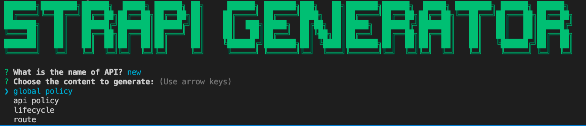
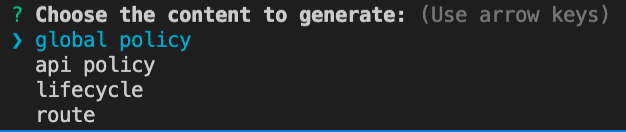

# strapi-generater

```
yarn add -D https://github.com/skynocover/strapi-generater
```

## Interface



### What is the name of API

> api 名稱,應該與資料夾路徑相同

### Choose the content to generate

> 選擇要產生的內容

- global policy, 全域policy
- api policy, 指定單一api的policy
- lifecycle, 指定單一api的lifecycle
- route, 產生custom api route



